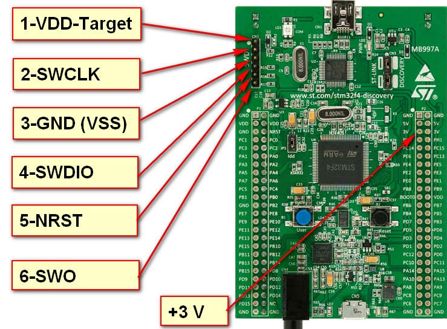

# programmer J-Link OB v7.0
модернизация китайской платы под свои хотелки

<h2>REV 1.0</h2>

 
 
выявленные недостатки: 
- не работает должным образом светодиод активности (схема на 555 таймере) похоже не успевает на 4000МГц. 

<h2>REV 2.0</h2>

 
 
ссылки: 
<a href="https://electronix.ru/forum/topic/59841-china-link-variant-otladchika-iz-kitaya/?do=findComment&comment=1515527">схема</a> 
<a href="https://electronix.ru/forum/topic/59841-china-link-variant-otladchika-iz-kitaya/?do=findComment&comment=1517115">инструкция по прошивке</a> 